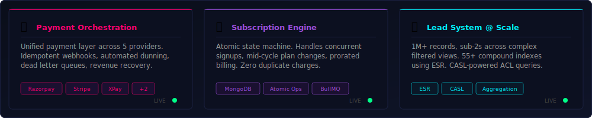
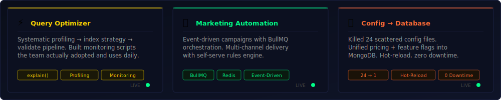

<!-- Animated Cyberpunk Header — commit header.svg to your repo -->
<a href="https://github.com/YOUR_USERNAME">
  
</a>

<p align="center">
  <a href="https://github.com/DenverCoder1/readme-typing-svg">
    
  </a>
</p>

<p align="center">
  <a href="https://linkedin.com/in/YOUR_LINKEDIN"></a>
  &#8287;&#8287;&#8287;&#8287;&#8287;
  <a href="https://twitter.com/YOUR_TWITTER"></a>
  &#8287;&#8287;&#8287;&#8287;&#8287;
  <a href="mailto:your.email@example.com"></a>
  &#8287;&#8287;&#8287;&#8287;&#8287;
  <a href="https://YOUR_USERNAME.github.io"></a>
</p>

<p align="center">
  <a href="https://github.com/YOUR_USERNAME?tab=repositories&sort=stargazers">
    
  </a>
  <a href="https://github.com/YOUR_USERNAME?tab=followers">
    
  </a>
  
</p>

<br/>

<!-- ═══════════════════════════════════════════════════════════════ -->
<!-- ABOUT -->
<!-- ═══════════════════════════════════════════════════════════════ -->

<details open>
<summary><h2>💼 About</h2></summary>

```yaml
location: Building things that process real money
role:     Full-Stack SaaS Engineer & Tech Lead
team:     5 engineers shipping enterprise software weekly

currently:
  - Orchestrating payments across 5 gateways with zero duplicate charges
  - Scaling lead management to 1M+ records with sub-2s queries  
  - Making MongoDB aggregation pipelines 70% faster with ESR indexing
  - Shipping subscription engines where race conditions don't exist

stack: [Node.js, MongoDB, React, TypeScript, Redis, BullMQ, FeathersJS]
```

</details>

<!-- ═══════════════════════════════════════════════════════════════ -->
<!-- METRICS DASHBOARD -->
<!-- ═══════════════════════════════════════════════════════════════ -->

<details open>
<summary><h2>📡 Production Metrics</h2></summary>

<br/>

<a href="https://github.com/YOUR_USERNAME">
  
</a>

</details>

<!-- ═══════════════════════════════════════════════════════════════ -->
<!-- PROJECTS -->
<!-- ═══════════════════════════════════════════════════════════════ -->

<details open>
<summary><h2>🏆 Systems I've Shipped</h2></summary>

<sub>Production enterprise systems. Real traffic, real money, real consequences.</sub>

<br/><br/>

<a href="https://github.com/YOUR_USERNAME">
  
</a>

<a href="https://github.com/YOUR_USERNAME">
  
</a>

</details>

<!-- ═══════════════════════════════════════════════════════════════ -->
<!-- TECH STACK -->
<!-- ═══════════════════════════════════════════════════════════════ -->

<details>
<summary><h2>🛠️ Tech Stack</h2></summary>

<br/>

<a href="https://github.com/YOUR_USERNAME">
  
</a>

<br/><br/>

<p align="center">
  &#8287;
  &#8287;
  &#8287;
  &#8287;
  &#8287;
  &#8287;
  &#8287;
  &#8287;
  &#8287;
  &#8287;
  &#8287;
  &#8287;
  
</p>

</details>

<!-- ═══════════════════════════════════════════════════════════════ -->
<!-- GITHUB STATS -->
<!-- ═══════════════════════════════════════════════════════════════ -->

<details open>
<summary><h2>📊 GitHub Stats</h2></summary>

<br/>

<p align="center">
  <a href="https://github.com/DenverCoder1/github-readme-streak-stats">
    
  </a>
</p>

<p align="center">
  <a href="https://github.com/anuraghazra/github-readme-stats">
    
  </a>
  <a href="https://github.com/anuraghazra/github-readme-stats">
    
  </a>
</p>

<sub>⚠️ Top languages ≠ skill level. My production work lives in private codebases.</sub>

<br/>

<p align="center">
  <a href="https://github.com/ashutosh00710/github-readme-activity-graph">
    
  </a>
</p>

<!-- Contribution Snake — set up github-contribution-grid-snake action -->
<!--  -->

<!--START_SECTION:activity-->
<!--END_SECTION:activity-->

</details>

<!-- ═══════════════════════════════════════════════════════════════ -->
<!-- ENGINEERING PHILOSOPHY -->
<!-- ═══════════════════════════════════════════════════════════════ -->

<details>
<summary><h2>💡 Engineering Philosophy</h2></summary>

<br/>

```javascript
const engineering = {
  
  performance: {
    rule:  "Measure → Profile → Index → Validate",
    proof: "8.5s → 2.1s on the query everyone said was 'just slow'"
  },

  payments: {
    rule:  "Every transaction is sacred. Every webhook is suspect.",
    proof: "0 duplicate charges across 5 gateways for 8+ months"
  },

  architecture: {
    rule:  "Design for 10x. Ship for today. Refactor when it hurts.",
    proof: "24-file config mess → 1 clean system, zero downtime"
  },

  leadership: {
    rule:  "Clear PRs > clever PRs.",
    proof: "5-person team shipping enterprise features weekly"
  }

};
```

</details>

<!-- ═══════════════════════════════════════════════════════════════ -->
<!-- FOOTER -->
<!-- ═══════════════════════════════════════════════════════════════ -->

<br/>


<p align="center">
  
</p>

<p align="center">
  <sub><code>if (you.need("payments", "performance", "scale"))</code> → <a href="mailto:your.email@example.com"><code>let's talk</code></a></sub>
</p>
